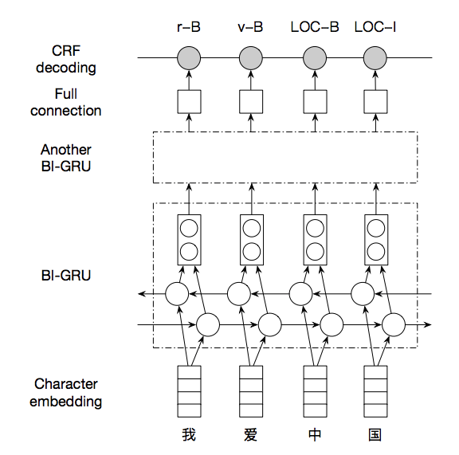

# 序列标注任务

## 1. 简介

Sequence Tagging，是一个序列标注模型，模型可用于实现，分词、词性标注、专名识别等序列标注任务。我们在自建的数据集上对分词、词性标注、专名识别进行整体的评估效果（即联合标签模型），具体数值见下表；

|模型|Precision|Recall|F1-score|
|:-:|:-:|:-:|:-:|
|Lexical Analysis|89.2%|89.4%|89.3%|

## 2. 快速开始

### 安装说明

#### 1.PaddlePaddle 安装

本项目依赖 PaddlePaddle 1.7 及以上版本和PaddleHub 1.0.0及以上版本 ，PaddlePaddle安装请参考官网 [快速安装](http://www.paddlepaddle.org/paddle#quick-start)，PaddleHub安装参考 [PaddleHub](https://github.com/PaddlePaddle/PaddleHub)。

> Warning: GPU 和 CPU 版本的 PaddlePaddle 分别是 paddlepaddle-gpu 和 paddlepaddle，请安装时注意区别。

#### 2. 克隆代码
克隆工具集代码库到本地
```bash
 git clone https://github.com/PaddlePaddle/hapi.git
 cd hapi/sequence_tagging
```

#### 3. 环境依赖
PaddlePaddle的版本要求是：Python 2 版本是 2.7.15+、Python 3 版本是 3.5.1+/3.6/3.7。sequence tagging的代码可支持Python2/3，无具体版本限制

### 数据准备

#### 1. 快速下载

本项目涉及的**数据集**和**训练模型**的数据可通过执行以下脚本进行快速下载，若仅需使用部分数据或者模型，可根据需要参照2和3进行下载

```bash
python downloads.py all
```
或在支持运行shell脚本的环境下执行：
```bash
sh downloads.sh
```

#### 2. 训练数据集

下载数据集文件，解压后会生成 `./data/` 文件夹
```bash
python downloads.py dataset
```

#### 3. 已训练模型

我们开源了在自建数据集上训练的词法分析模型，可供用户直接使用，可通过下述链接进行下载:
```bash
# download baseline model
python downloads.py lac
```

### 模型训练
基于示例的数据集，可通过下面的命令，在训练集 `./data/train.tsv` 上进行训练；

GPU上单卡训练
```
# setting visible devices for training
export CUDA_VISIBLE_DEVICES=0

python -u train.py \
          --train_file ./data/train.tsv \
          --test_file ./data/test.tsv \
          --word_dict_path ./conf/word.dic \
          --label_dict_path ./conf/tag.dic \ 
          --word_rep_dict_path ./conf/q2b.dic \
          --device gpu \
          --grnn_hidden_dim 128 \
          --word_emb_dim 128 \
          --bigru_num 2 \
          --base_learning_rate 1e-3 \
          --batch_size 300 \
          --epoch 10 \
          --save_dir   ./model \
          --num_devices 1 \
          -d

# -d： 是否使用动态图模式进行训练，如果使用静态图训练，命令行请删除-d参数
```
GPU上多卡训练
```
# setting visible devices for training
export CUDA_VISIBLE_DEVICES=0,1,2,3

python -m paddle.distributed.launch --selected_gpus=0,1,2,3  train.py \
          --train_file ./data/train.tsv \
		  --test_file  ./data/test.tsv \
          --word_dict_path ./conf/word.dic \
          --label_dict_path ./conf/tag.dic \ 
          --word_rep_dict_path ./conf/q2b.dic \
          --device gpu \
          --grnn_hidden_dim 128 \
          --word_emb_dim 128 \
          --bigru_num 2 \
          --base_learning_rate 1e-3 \
          --batch_size 300 \
          --epoch 10 \
          --save_dir   ./model \
          -d

# -d： 是否使用动态图模式进行训练，如果使用静态图训练，命令行请删除-d参数
```
CPU上训练
```
python -u train.py \
          --train_file ./data/train.tsv \
		  --test_file ./data/test.tsv \
          --word_dict_path ./conf/word.dic \
          --label_dict_path ./conf/tag.dic \ 
          --word_rep_dict_path ./conf/q2b.dic \
          --device cpu \
          --grnn_hidden_dim 128 \
          --word_emb_dim 128 \
          --bigru_num 2 \
          --base_learning_rate 1e-3 \
          --batch_size 300 \
          --epoch 10 \
          --save_dir   ./model \
          -d

```

### 模型预测

加载已有的模型，对未知的数据进行预测
```bash
python predict.py \
          --predict_file ./data/infer.tsv \
		  --word_dict_path ./conf/word.dic \
		  --label_dict_path ./conf/tag.dic \
		  --word_rep_dict_path ./conf/q2b.dic \
		  --init_from_checkpoint  model_baseline/params \
		  --output_file predict.result  \
		  --mode predict \
		  --device gpu  \
		  -d 
		  
# -d： 是否使用动态图模式进行训练，如果使用静态图训练，命令行请删除-d参数

```

### 模型评估

我们基于自建的数据集训练了一个词法分析的模型，可以直接用这个模型对测试集 `./data/test.tsv` 进行验证，
```bash
# baseline model
python eval.py \
        --test_file  ./data/test.tsv \
		--word_dict_path ./conf/word.dic  \
		--label_dict_path ./conf/tag.dic  \
		--word_rep_dict_path ./conf/q2b.dic \
		--init_from_checkpoint  ./model_baseline/params \
		--device gpu  \
		-d

# -d： 是否使用动态图模式进行训练，如果使用静态图训练，命令行请删除-d参数
```


## 3. 进阶使用

### 任务定义与建模
序列标注任务的输入是一个字符串（我们后面使用『句子』来指代它），而输出是句子中的词边界和类别。序列标注是词法分析的经典建模方式。我们使用基于 GRU 的网络结构学习特征，将学习到的特征接入 CRF 解码层完成序列标注。CRF 解码层本质上是将传统 CRF 中的线性模型换成了非线性神经网络，基于句子级别的似然概率，因而能够更好的解决标记偏置问题。模型要点如下。

1. 输入采用 one-hot 方式表示，每个字以一个 id 表示
2. one-hot 序列通过字表，转换为实向量表示的字向量序列；
3. 字向量序列作为双向 GRU 的输入，学习输入序列的特征表示，得到新的特性表示序列，我们堆叠了两层双向GRU以增加学习能力；
4. CRF 以 GRU 学习到的特征为输入，以标记序列为监督信号，实现序列标注。

可供用户下载的自有数据是对分词、词性标注、专名识别同时标注的联合数据集，进行词性和专名类别标签集合如下表，其中词性标签 24 个（小写字母），专名类别标签 4 个（大写字母）。这里需要说明的是，人名、地名、机构名和时间四个类别，在上表中存在两套标签（PER / LOC / ORG / TIME 和 nr / ns / nt / t），被标注为第二套标签的词，是模型判断为低置信度的人名、地名、机构名和时间词。开发者可以基于这两套标签，在四个类别的准确、召回之间做出自己的权衡。

| 标签 | 含义     | 标签 | 含义     | 标签 | 含义     | 标签 | 含义     |
| ---- | -------- | ---- | -------- | ---- | -------- | ---- | -------- |
| n    | 普通名词 | f    | 方位名词 | s    | 处所名词 | t    | 时间     |
| nr   | 人名     | ns   | 地名     | nt   | 机构名   | nw   | 作品名   |
| nz   | 其他专名 | v    | 普通动词 | vd   | 动副词   | vn   | 名动词   |
| a    | 形容词   | ad   | 副形词   | an   | 名形词   | d    | 副词     |
| m    | 数量词   | q    | 量词     | r    | 代词     | p    | 介词     |
| c    | 连词     | u    | 助词     | xc   | 其他虚词 | w    | 标点符号 |
| PER  | 人名     | LOC  | 地名     | ORG  | 机构名   | TIME | 时间     |

### 模型原理介绍
上面介绍的模型原理如下图所示：<br />



### 数据格式
训练使用的数据可以由用户根据实际的应用场景，自己组织数据。除了第一行是 `text_a\tlabel` 固定的开头，后面的每行数据都是由两列组成，以制表符分隔，第一列是 utf-8 编码的中文文本，以 `\002` 分割，第二列是对应每个字的标注，以 `\002` 分隔。我们采用 IOB2 标注体系，即以 X-B 作为类型为 X 的词的开始，以 X-I 作为类型为 X 的词的持续，以 O 表示不关注的字（实际上，在词性、专名联合标注中，不存在 O ）。示例如下：

```text
除\002了\002他\002续\002任\002十\002二\002届\002政\002协\002委\002员\002,\002马\002化\002腾\002,\002雷\002军\002,\002李\002彦\002宏\002也\002被\002推\002选\002为\002新\002一\002届\002全\002国\002人\002大\002代\002表\002或\002全\002国\002政\002协\002委\002员	p-B\002p-I\002r-B\002v-B\002v-I\002m-B\002m-I\002m-I\002ORG-B\002ORG-I\002n-B\002n-I\002w-B\002PER-B\002PER-I\002PER-I\002w-B\002PER-B\002PER-I\002w-B\002PER-B\002PER-I\002PER-I\002d-B\002p-B\002v-B\002v-I\002v-B\002a-B\002m-B\002m-I\002ORG-B\002ORG-I\002ORG-I\002ORG-I\002n-B\002n-I\002c-B\002n-B\002n-I\002ORG-B\002ORG-I\002n-B\002n-I
```

+ 我们随同代码一并发布了完全版的模型和相关的依赖数据。但是，由于模型的训练数据过于庞大，我们没有发布训练数据，仅在`data`目录下放置少数样本用以示例输入数据格式。

+ 模型依赖数据包括：
    1. 输入文本的词典，在`conf`目录下，对应`word.dic`
    2. 对输入文本中特殊字符进行转换的字典，在`conf`目录下，对应`q2b.dic`
    3. 标记标签的词典,在`conf`目录下，对应`tag.dic`

+ 在训练和预测阶段，我们都需要进行原始数据的预处理，具体处理工作包括：

    1. 从原始数据文件中抽取出句子和标签，构造句子序列和标签序列
    2. 将句子序列中的特殊字符进行转换
    3. 依据词典获取词对应的整数索引

### 代码结构说明
```text
├── README.md                          # 本文档
├── data/                                   # 存放数据集的目录
├── conf/                                   # 词典及程序默认配置的目录
├── images/                               # 文档图片存放位置
├── utils/                                   # 常用工具函数
├── train.py                               # 训练脚本
├── predict.py                           # 预测脚本
├── eval.py                               # 词法分析评估的脚本
├── downloads.py                      # 用于下载数据和模型的脚本
├── downloads.sh                      # 用于下载数据和模型的脚本
└──reader.py                           # 文件读取相关函数
```


## 4. 其他
### 在论文中引用 sequence tagging

如果您的学术工作成果中使用了 sequence tagging，请您增加下述引用。我们非常欣慰sequence tagging模型能够对您的学术工作带来帮助。

```text
@article{jiao2018LAC,
	title={Chinese Lexical Analysis with Deep Bi-GRU-CRF Network},
	author={Jiao, Zhenyu and Sun, Shuqi and Sun, Ke},
	journal={arXiv preprint arXiv:1807.01882},
	year={2018},
	url={https://arxiv.org/abs/1807.01882}
}
```
### 如何贡献代码
如果你可以修复某个 issue 或者增加一个新功能，欢迎给我们提交PR。如果对应的PR被接受了，我们将根据贡献的质量和难度 进行打分（0-5分，越高越好）。如果你累计获得了 10 分，可以联系我们获得面试机会或为你写推荐信。
