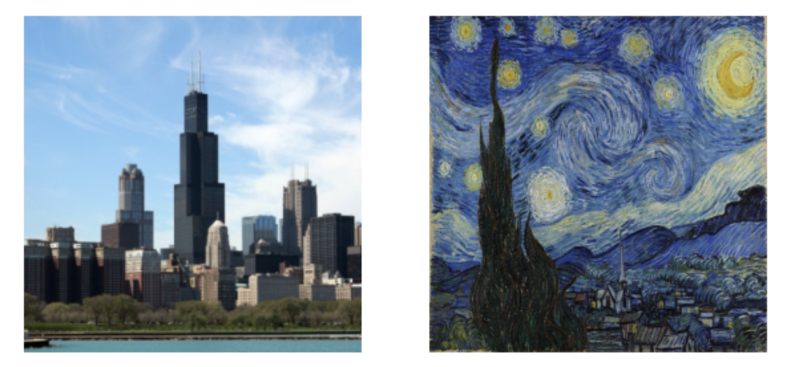
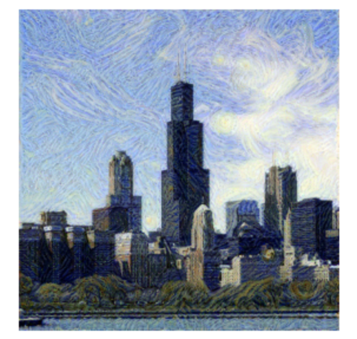
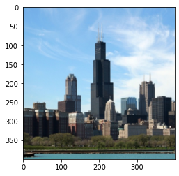

# 图像风格迁移


图像的风格迁移是卷积神经网络有趣的应用之一。那什么是风格迁移呢？下图第一列左边的图为相机拍摄的一张普通图片，右边的图为梵高的名画星空。那如何让左边的普通图片拥有星空的风格呢。神经网络的风格迁移就可以帮助你生成第二列的这样的图片。

<!-- 

 -->

<div align=center>
 
</br>
 

<div align=left>

```python
%matplotlib inline

import numpy as np
import matplotlib.pyplot as plt

from model import Model, Loss
from models import vgg16
from paddle import fluid
import cv2
import copy

from transform import transforms
from paddle.fluid.io import Dataset
```


```python
# 启动动态图模式
fluid.enable_dygraph()
```


```python
# 载入图像并进行预处理
def load_image(image_path, max_size=400, shape=None):
    image = cv2.imread(image_path)
    image = image.astype('float32') / 255.0
    size = shape if shape is not None else max_size if max(image.shape[:2]) > max_size else max(image.shape[:2])

    transform = transforms.Compose([transforms.Resize(size),
                                    transforms.Permute(),
                                   transforms.Normalize([0.485, 0.456, 0.406],[0.229, 0.224, 0.225])])
    image = transform(image)[np.newaxis,:3,:,:]
    image = fluid.dygraph.to_variable(image)
    return image  
```


```python
# 将图像从预处理中恢复
def image_restore(image):
    image = np.squeeze(image.numpy(), 0)
    image = image.transpose(1,2,0)
    image = image * np.array((0.229, 0.224, 0.225)) + np.array((0.485, 0.456, 0.406))

    image = image.clip(0, 1)
    return image
```


```python
# 内容图像，用于风格迁移
content_path = './images/chicago_cropped.jpg'
# 风格图像
style_path = './images/Starry-Night-by-Vincent-Van-Gogh-painting.jpg'
```


```python
# 可视化两个图像
content = load_image(content_path)
style = load_image(style_path, shape=tuple(content.shape[-2:]))

fig, (ax1, ax2) = plt.subplots(1, 2, figsize=(10, 10))
ax1.imshow(image_restore(content))
ax2.imshow(image_restore(style))
```


    <matplotlib.image.AxesImage at 0x7fc73005c890>


```python
# 定义风格迁移模型，使用在imagenet上预训练好的vgg16作为基础模型
class StyleTransferModel(Model):
    def __init__(self):
        super(StyleTransferModel, self).__init__()
        # pretrained设置为true，会自动下载imagenet上的预训练权重并加载
        vgg = vgg16(pretrained=True)
        self.base_model = vgg.features
        for p in self.base_model.parameters():
            p.stop_gradient=True
        self.layers = {
                  '0': 'conv1_1',
                  '3': 'conv2_1',
                  '6': 'conv3_1',
                  '10': 'conv4_1',
                  '11': 'conv4_2',  ## content representation
                  '14': 'conv5_1'
                 }

    def forward(self, image):
        outputs = []
        for name, layer in self.base_model.named_sublayers():
            image = layer(image)
            if name in self.layers:
                outputs.append(image)
        return outputs
```


```python
class StyleTransferLoss(Loss):
    def __init__(self, content_loss_weight=1, style_loss_weight=1e5, style_weights=[1.0, 0.8, 0.5, 0.3, 0.1]):
        super(StyleTransferLoss, self).__init__()
        self.content_loss_weight = content_loss_weight
        self.style_loss_weight = style_loss_weight
        self.style_weights = style_weights

    def forward(self, outputs, labels):
        content_features = labels[-1]
        style_features = labels[:-1]

        # 计算图像内容相似度的loss
        content_loss = fluid.layers.mean((outputs[-2] - content_features)**2)

        # 计算风格相似度的loss
        style_loss = 0
        style_grams = [self.gram_matrix(feat) for feat in style_features ]
        style_weights = self.style_weights
        for i, weight in enumerate(style_weights):
            target_gram = self.gram_matrix(outputs[i])
            layer_loss = weight * fluid.layers.mean((target_gram - style_grams[i])**2)
            b, d, h, w = target.shape
            style_loss += layer_loss / (d * h * w)

        total_loss = self.content_loss_weight * content_loss + self.style_loss_weight * style_loss
        return total_loss

    def gram_matrix(self, A):
        if len(A.shape) == 4:
            batch_size, c, h, w = A.shape
            A = fluid.layers.reshape(A, (c, h*w))
        GA = fluid.layers.matmul(A, fluid.layers.transpose(A, [1, 0]))

        return GA
```


```python
# 创建模型
model = StyleTransferModel()
```

    2020-04-14 03:32:11,567-INFO: File /root/.cache/paddle/hapi/weights/vgg16.pdparams md5 checking...
    2020-04-14 03:32:13,523-INFO: Found /root/.cache/paddle/hapi/weights/vgg16.pdparams


```python
# 创建损失函数
style_loss = StyleTransferLoss()
```


```python
# 使用内容图像初始化要生成的图像
target = Model.create_parameter(model, shape=content.shape)
target.set_value(content.numpy())
```


```python
# 创建优化器
optimizer = fluid.optimizer.Adam(parameter_list=[target], learning_rate=0.001)
```


```python
# 初始化高级api
model.prepare(optimizer, style_loss)
```


```python
# 使用内容图像和风格图像获取内容特征和风格特征
content_fetures = model.test(content)
style_features = model.test(style)
```


```python
# 将两个特征组合，作为损失函数的label传给模型
feats = style_features + [content_fetures[-2]]
```


```python
# 训练5000个step，每500个step画一下生成的图像查看效果
steps = 5000
for i in range(steps):
    outs = model.train(target, feats)

    if i % 500 == 0:
        print('iters:', i, 'loss:', outs[0])
        plt.imshow(image_restore(target))
        plt.show()
```

    iters: 0 loss: [5.442985e+10]


    iters: 500 loss: [2.4129636e+09]


    iters: 1000 loss: [1.2192547e+09]


    iters: 1500 loss: [8.4675136e+08]


    iters: 2000 loss: [6.473546e+08]


    iters: 2500 loss: [5.1857123e+08]


    iters: 3000 loss: [4.2777142e+08]


    iters: 3500 loss: [3.5934938e+08]


    iters: 4000 loss: [3.0522618e+08]


    iters: 4500 loss: [2.6055994e+08]


```python
# 风格迁移后的图像
fig, (ax1, ax2, ax3) = plt.subplots(1, 3, figsize=(20, 10))
ax1.imshow(image_restore(content))
ax2.imshow(image_restore(target))
ax3.imshow(image_restore(style))
```


    <matplotlib.image.AxesImage at 0x7fc72b7e2410>



